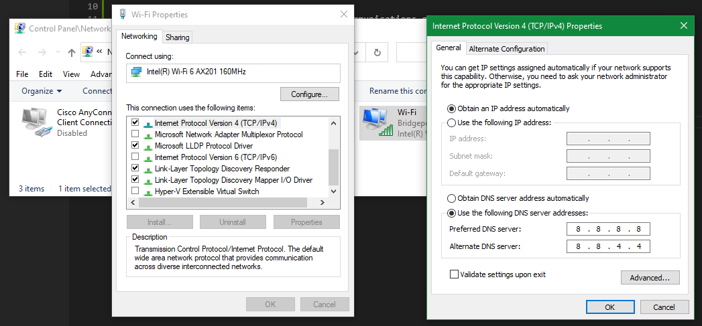

# MyPC

My PC

## DNS Server Not Responding

Fri Jul 8, Rogers outage across Canada!

July 2022 Rogers Communications outage

<https://en.wikipedia.org/wiki/2022_Rogers_Communications_outage>

Sat Jul 9, Internet is back but the laptop can't access with the error message "DNS Server Not Responding".

Tried many ways and resolved with this -

Control Panel\Network and Internet\Network Connections

Wifi -> Properties

Internet Protocol Version 4 (TCP/IPv4) -> Properties

It was "Obtain DNS server address automatically".

Change it to -

8.8.8.8 and 8.8.4.4
